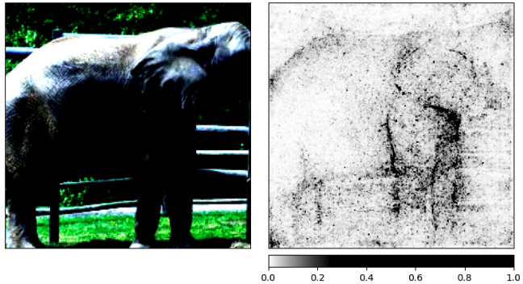
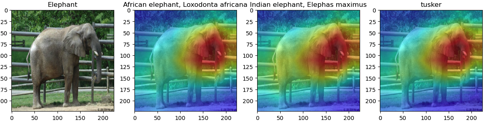

# XAI Project
The goal of this project was to explore different ways to explain image outputs using XAI techniques. The Integrated Gradient and Gradcam methods were implemented and tested on the provided elephant.png image. The Yolov1 model was also implemented to try the ODAM method, which is a Gradcam-like method.

# Integrated Gradient
The Integrated Gradient method was implemented and tested on the provided elephant.png image using the PyTorch library. The explanation was generated using 50 steps in the integration path. The resulting heatmap shows which pixels were most important in the classification decision made by the model. 
Bellow is the result of the implementation:

# Gradcam
The Gradcam method was also implemented and tested on the provided elephant.png image using the PyTorch library. The resulting heatmap shows which areas of the image were most important in the classification decision made by the model. The heatmap is saved as 'gradcam.png' in the project directory.

# ODAM 
ODAM is a framework for generating instance-specific heat maps to explain the predictions of an object detector. It uses a local smoothing operation on the gradient map to set the importance weight map and obtain the corresponding heat map. ODAM generates instance-specific heat maps for explaining the predictions of an object detector, using auxiliary losses to encourage heat maps for predictions on the same object to be consistent and for different objects to be distinct. It highlights the important feature regions used by the detector to classify the instance, and it is faster than perturbation-based methods.

# Yolov1 and Yolov3
The Yolov1 and Yolov3 models were implemented to try the ODAM method. However, due to time constraints, only Yolov1 was trained.

# Project Structure
The project is structured as follows:

        The ODAM Implementation.ipynb notebook contains the implementation and testing of the ODAM method.
        The Yolov1 directory contains the code and resources for the Yolov1 model implementation and training.
        The Yolov3 directory contains the code for the Yolov3 model, but it was not used in this project.
        The classic_xai_methods.ipynb notebook contains the code for the Integrated Gradient and Gradcam implementations and testing.
        The data directory contains the provided elephant.png image.
        The README.md file (this file) contains the project description and instructions.
        Note that some files, such as logs and batch files, are not described here for simplicity.

# Conclusion
This project implemented and tested two XAI techniques, Integrated Gradient and Gradcam, on an image classification problem. The ODAM method was  implemented but still requires further work, the Yolov1 model was trained and resources were provided for future development. The project structure and code can be used as a starting point for future XAI projects on image classification problems.